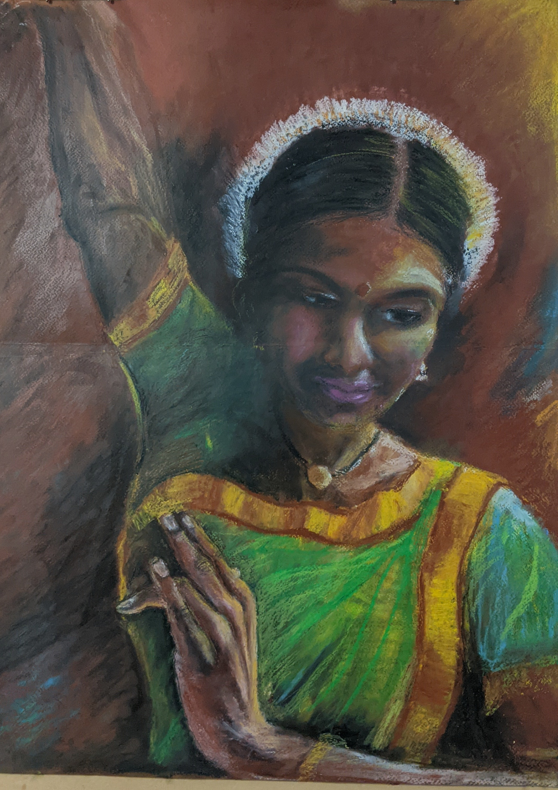

## **
PERSONAL INTERESTS
**
<ins><b>Painting</b></ins>

    Markdown css styles

I like to paint from time to time. Started with charcoal and transitioned to oil pastels. 
<html>
<head>

</head>
</html>
<body>

<h2>Center Text</h2>

  
This text is centered.

</body>
<body>
  

  
  
Bharatham

 

  
  
Dream

</body>
