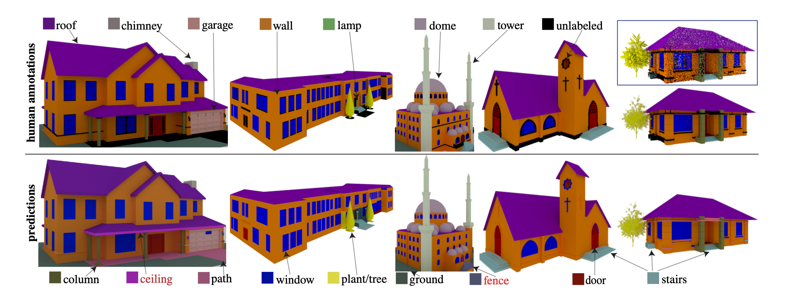

<h3>Abstract</h3>
We introduce BuildingNet: (a) a large-scale dataset of 3D building models whose exteriors are consistently la- beled, and (b) a graph neural network that labels build- ing meshes by analyzing spatial and structural relations of their geometric primitives. To create our dataset, we used crowdsourcing combined with expert guidance, resulting in 513K annotated mesh primitives, grouped into 292K se- mantic part components across 2K building models. The dataset covers several building categories, such as houses, churches, skyscrapers, town halls, libraries, and castles. We include a benchmark for evaluating mesh and point cloud labeling. Buildings have more challenging structural com- plexity compared to objects in existing benchmarks (e.g., ShapeNet, PartNet), thus, we hope that our dataset can nur- ture the development of algorithms that are able to cope with such large-scale geometric data for both vision and graphics tasks e.g., 3D semantic segmentation, part-based generative models, correspondences, texturing, and anal- ysis of point cloud data acquired from real-world build- ings. Finally, we show that our mesh-based graph neu- ral network significantly improves performance over sev- eral baselines for labeling 3D meshes.

[Download paper here](https://drive.google.com/file/d/1aD5AIkx58k7EyK8Utg8vKv2Y_UMZ--pv/view)
