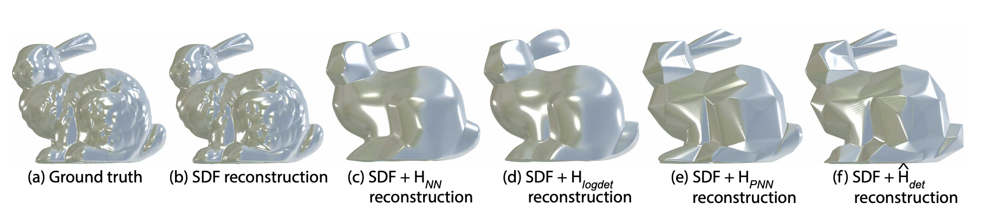

<h3>Abstract</h3> 
Developability refers to the process of creating a surface without any tearing or shearing from a two-dimensional plane. It finds practical applications in the fabrication industry. An essential characteristic of a developable 3D surface is its zero Gaussian curvature, which means that either one or both of the principal curvatures are zero. This paper introduces a method for reconstructing an approximate developable surface from a neural implicit surface. The central idea of our method involves incorporating a regularization term that operates on the second-order derivatives of the neural implicits, effectively promoting zero Gaussian curvature. Implicit surfaces offer the advantage of smoother deformation with infinite resolution, overcoming the high polygonal constraints of state-of-the-art methods using discrete representations. We draw inspiration from the prop- erties of surface curvature and employ rank minimization techniques derived from compressed sensing. Experimental results on both developable and non-developable surfaces, including those affected by noise, validate the generalizability of our method.

[Download paper here](https://arxiv.org/abs/2308.03900)

